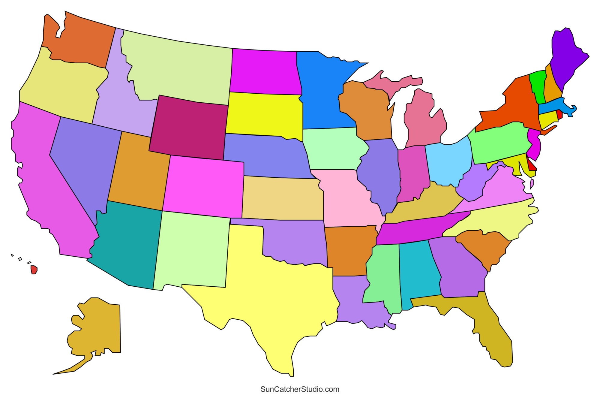

# US States Game

This is a simple US states guessing game using Python's `turtle` module for graphical display and `pandas` for data handling. The goal of the game is to guess all 50 US states. The program prompts the user to input the name of a state, and if it is correct, the name of the state is displayed on the map at the appropriate location. If the user types "Exit," the program will end and create a CSV file listing the states they still need to learn.

## Features
- Graphical representation of the US map using the `turtle` module.
- Keeps track of the states that have been guessed correctly.
- Exports a CSV file of states to learn if the game is exited early.

## Prerequisites
- Python 3.x
- `pandas` library (used for data manipulation)

## Installation

1. Clone the repository or download the code.
2. Make sure you have Python 3.x installed on your system.
3. Install the required dependencies by running:

    ```bash
    pip install -r requirements.txt
    ```

4. Ensure you have the following files:
   - `blank_states_img.gif`: Image of the US map.
   - `50_states.csv`: A CSV file containing the states and their corresponding coordinates.

## How to Run

1. Run the Python script:

    ```bash
    python your_script_name.py
    ```

2. A window will open displaying the US map. You can start entering state names in the prompt.
3. If you wish to quit the game, type "Exit" in the prompt. A CSV file (`states_to_learn.csv`) will be created listing the states you didn't guess.

## Files
- `50_states.csv`: Contains a list of the 50 US states with their respective x and y coordinates on the map.
- `blank_states_img.gif`: The image used as the US map.
- `states_to_learn.csv`: A CSV file generated when you exit the game early, containing the names of the states you still need to guess.

## Example



## License
This project is licensed under the MIT License - see the LICENSE file for details.

